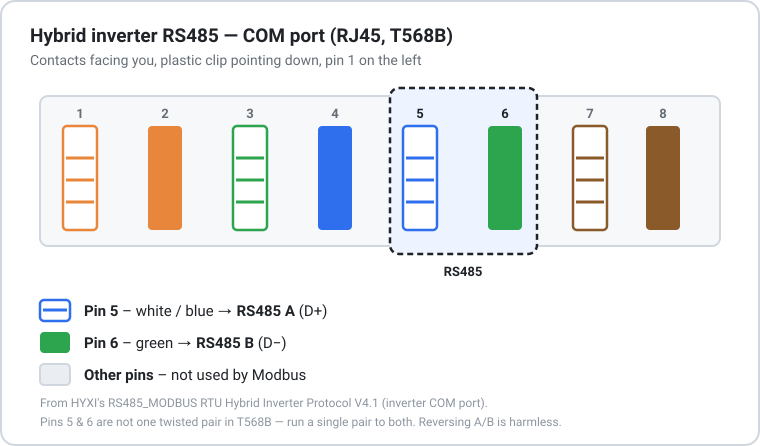
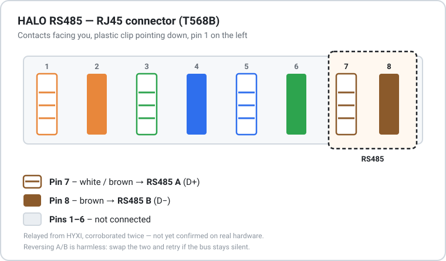

# Where the Modbus register facts come from

Every register value in this integration traces to one of four kinds of
source, and they are **not** equally trustworthy. This file records which is
which, so a later change does not quietly promote a guess to a fact.

The short version: **hardware observation outranks a vendor document, a
vendor document outranks a relayed claim about a private vendor
communication, and a relayed claim outranks anything inferred from the
cloud API.** Where two sources disagree, that disagreement is evidence and
must be preserved, not resolved by making one match the other. And within
"vendor document": a document written for the exact hardware family in use
outranks one written for a different family whose examples happened to
decode against it.

## Sources

| Source | Covers | Standing |
| :--- | :--- | :--- |
| HYXIPower *RS485_MODBUS RTU Hybrid Inverter Protocol*, V4.1, 2025-06-13 | HYX-H(5\~12)K-HT (incl. the H10K-HT on the bench), HYX-H(15\~25)K-HT, HYX-H(6\~15)K-HTA/HTAC — registers 0–1351 and 973–3121 | **Vendor claim, current document, exact hardware family.** Supplied directly for this project. The strongest source held for any device here — not yet checked against a device, but not borrowed from a different product's document either. |
| HYXIPower *Micro Storage RS485 MODBUS* protocol, V1.0, 2026-02-10 | HALO / HYX-MS3000AC, registers 4002–5023 | **Vendor claim.** Obtained directly from HYXI with confirmation that it may be published. Not yet checked against a device — no HALO has been on a bus. Gives serial parameters only; no pinout — see "HALO's RS485 wiring" below. |
| HYXIPower *HYX-H(5\~12)K-HT User Manual*, V1.2, 2024-07 | Alarm code table; lists port 14 as "Reserved Communication" with no pinout | **Vendor, published.** Superseded on the pinout question by the protocol document above — see below. |
| [Issue #662](https://github.com/Veldkornet/ha-hyxi-cloud/issues/662) and a [matching HA community post](https://community.home-assistant.io/t/hyxipower-integration/926093/28), both user Ton123 — the same contributor who supplied the *Micro Storage RS485 MODBUS* document two rows above | HALO / HYX-MS3000AC RS485 pinout: PIN7 = A, PIN8 = B (T568B white-brown / brown), RJ45 in a circular weatherproof housing, all other pins unused | **First-party to this project, relayed claim, corroborated twice, unconfirmed on hardware.** Stated on this repo's own issue tracker by the person who obtained and supplied the HALO protocol document itself. HYXI has now given the assignment twice — the original ("PIN7 = A, PIN8 = B … white-brown and brown") and a later re-confirmation Ton123 requested ("from right to left: first pin 485B, then 485A, others idle"), which agrees once counted from the other end. Still a relayed account of private messages, not text in the document (serial parameters only, no pinout), and no HALO has been on a bus. See "HALO's RS485 wiring" below. |
| `hyxi_cloud_api.VPP_ACTIVE_MODES` | Cloud `workMode` values 13 and 14 | **Inference, unconfirmed.** Derived by reverse-engineering the HYXI phone app's APK. Never observed on a device. See rule 1. |

## HALO register map (from registers.py)

Generated directly from the Component classes -- this table cannot drift from the code, because it is read out of the code. "sensor: X" shows the cloud metric key `client.py`'s `_build_metrics()` maps a field to, matched by which component instance it came from (not just field name -- `HaloGrid.frequency` and `HaloBackup.frequency` are different registers with the same field name, and only one of them is actually read). "device info: X" means the field feeds the HA device registry entry (model/serial/versions shown on the device page) rather than a sensor entity. "used by a control method" means a `set_mode_*`/`set_peak_shaving` write touches it but nothing reads it back. "debug log only" means it is read and logged at setup but stored nowhere a user sees. "*(not exposed)*" means the register is modeled but genuinely unused beyond that.

### HaloIdentity  (space=input)

| Addr | Field | Type | R/W | Scale | Unit | Exposed as |
| ---: | :--- | :--- | :--- | :--- | :--- | :--- |
| 4002 | `model_low` | Number (unsigned) | RO |  |  | device info: `model` |
| 4006 | `model_high` | Number (unsigned) | RO |  |  | — *(not exposed)* |
| 4018 | `serial_number` | Number (unsigned) | RO |  |  | device key (via `serial_number` property) |
| 4026 | `arm_version` | Number (unsigned) | RO |  |  | device info: `sw_version` |
| 4028 | `dsp_version` | Number (unsigned) | RO |  |  | debug log only |
| 4034 | `hardware_version` | Number (unsigned) | RO |  |  | device info: `hw_version` |
| 4046 | `rated_power` | Number (signed) | RO |  | W | sensor: `ratedPower` |
| 4048 | `rated_frequency` | Number (signed) | RO | ×0.01 | Hz | sensor: `ratedFrequency` |
| 4049 | `rated_voltage` | Number (unsigned) | RO | ×0.01 | V | sensor: `ratedVoltage` |
| 4962 | `battery_serial_number` | Number (unsigned) | RO |  |  | sensor: `batSn` |

### HaloStatus  (space=input)

| Addr | Field | Type | R/W | Scale | Unit | Exposed as |
| ---: | :--- | :--- | :--- | :--- | :--- | :--- |
| 4100 | `switch_status` | Number (unsigned) | RO |  |  | sensor: `deviceSwitchStatus` |
| 4101 | `work_state` | Number (unsigned) | RO |  |  | sensor: `invSts` |
| 4102 | `work_mode` | Number (unsigned) | RO |  |  | sensor: `workMode` |
| 4103 | `grid_state` | Number (unsigned) | RO |  |  | sensor: `gridSts` |
| 4104 | `insulation_resistance` | Number (unsigned) | RO |  |  | sensor: `insulationResistance` |
| 4105 | `leakage_current` | Number (unsigned) | RO |  |  | sensor: `leakageCurrent` |
| 4106 | `bus_voltage` | Number (unsigned) | RO | ×0.1 | V | sensor: `vbus` |
| 4109 | `ambient_temperature` | Number (signed) | RO | ×0.1 | °C | sensor: `ambientTemper` |
| 4110 | `ac_temperature` | Number (signed) | RO | ×0.1 | °C | sensor: `tinv` |
| 4111 | `dc_temperature` | Number (signed) | RO | ×0.1 | °C | sensor: `dcSideTemper` |
| 4123 | `meter_online` | Number (unsigned) | RO |  |  | sensor: `meterOnline` |

### HaloGrid  (space=input)

| Addr | Field | Type | R/W | Scale | Unit | Exposed as |
| ---: | :--- | :--- | :--- | :--- | :--- | :--- |
| 4151 | `frequency` | Number (signed) | RO | ×0.01 | Hz | sensor: `f`, `gridF` |
| 4152 | `active_power` | Number (signed) | RO | ×0.001 | kW | sensor: `gridP` |
| 4154 | `reactive_power` | Number (signed) | RO | ×0.001 | kW | sensor: `gridQ` |
| 4156 | `apparent_power` | Number (signed) | RO | ×0.001 | kW | sensor: `gridAp` |
| 4158 | `power_factor` | Number (signed) | RO | ×0.01 |  | sensor: `gridPfd` |
| 4161 | `voltage` | Number (unsigned) | RO | ×0.01 | V | sensor: `ph1v` |
| 4162 | `current` | Number (signed) | RO | ×0.1 | A | sensor: `ph1i` |
| 4163 | `phase_power` | Number (signed) | RO | ×0.001 | kW | sensor: `ph1p` |

### HaloBackup  (space=input)

| Addr | Field | Type | R/W | Scale | Unit | Exposed as |
| ---: | :--- | :--- | :--- | :--- | :--- | :--- |
| 4200 | `frequency` | Number (signed) | RO | ×0.01 | Hz | sensor: `offGridF` |
| 4201 | `active_power` | Number (signed) | RO | ×0.001 | kW | sensor: `offGridP` |
| 4210 | `voltage` | Number (unsigned) | RO | ×0.01 | V | sensor: `offGridV` |
| 4211 | `current` | Number (signed) | RO | ×0.1 | A | sensor: `offGridI` |
| 4212 | `phase_power` | Number (signed) | RO | ×0.001 | kW | sensor: `ph1Loadp` |

### HaloEnergy  (space=input)

| Addr | Field | Type | R/W | Scale | Unit | Exposed as |
| ---: | :--- | :--- | :--- | :--- | :--- | :--- |
| 4500 | `output_today` | Number (unsigned) | RO | ×0.001 | kWh | sensor: `eToday` |
| 4502 | `output_total` | Number (unsigned) | RO | ×0.001 | kWh | sensor: `totalE` |
| 4506 | `battery_charged_total` | Number (unsigned) | RO | ×0.001 | kWh | sensor: `batCharge`, `totalEchg` |
| 4510 | `battery_discharged_total` | Number (unsigned) | RO | ×0.001 | kWh | sensor: `batDisCharge`, `totalEdchg` |
| 4512 | `input_today` | Number (unsigned) | RO | ×0.001 | kWh | sensor: `eTodayIn` |
| 4514 | `input_total` | Number (unsigned) | RO | ×0.001 | kWh | sensor: `totalEnt` |

### HaloFaults  (space=input)

| Addr | Field | Type | R/W | Scale | Unit | Exposed as |
| ---: | :--- | :--- | :--- | :--- | :--- | :--- |
| 4850 | `hardware_fault` | Raw | RO |  |  | — *(not exposed)* |
| 4851 | `software_fault_1` | Raw | RO |  |  | — *(not exposed)* |
| 4852 | `software_fault_2` | Raw | RO |  |  | — *(not exposed)* |
| 4853 | `software_fault_3` | Raw | RO |  |  | — *(not exposed)* |
| 4857 | `software_alarm_1` | Raw | RO |  |  | — *(not exposed)* |

### HaloBattery  (space=input)

| Addr | Field | Type | R/W | Scale | Unit | Exposed as |
| ---: | :--- | :--- | :--- | :--- | :--- | :--- |
| 4978 | `pack_count` | Number (unsigned) | RO |  |  | sensor: `packNum` |
| 4979 | `bms_state` | Number (unsigned) | RO |  |  | sensor: `bmsState` |
| 4980 | `soc` | Number (unsigned) | RO | ×0.1 | % | sensor: `batSoc` |
| 4981 | `soh` | Number (unsigned) | RO | ×0.1 | % | sensor: `batSoh` |
| 4982 | `temperature` | Number (signed) | RO | ×0.1 | °C | sensor: `batTmp` |
| 4985 | `power` | Number (signed) | RO | ×0.001 | kW | sensor: `batP`, `pbat` |
| 4989 | `cell_voltage_max` | Number (unsigned) | RO | ×0.001 | V | sensor: `batVch` |
| 4990 | `cell_voltage_min` | Number (unsigned) | RO | ×0.001 | V | sensor: `batVcl` |
| 4995 | `cell_temperature_max` | Number (signed) | RO | ×0.1 | °C | sensor: `batTch` |
| 4996 | `cell_temperature_min` | Number (signed) | RO | ×0.1 | °C | sensor: `batTcl` |
| 5000 | `alarm_1` | Raw | RO |  |  | sensor: `batAlarm1` |
| 5001 | `alarm_2` | Raw | RO |  |  | sensor: `batAlarm2` |
| 5002 | `alarm_3` | Raw | RO |  |  | sensor: `batAlarm3` |
| 5020 | `capacity_ah` | Number (unsigned) | RO |  | Ah | sensor: `batCapacityAh` |
| 5021 | `max_discharge_power` | Number (unsigned) | RO | ×0.001 | kW | sensor: `maxDischargePower` |
| 5023 | `max_charge_power` | Number (unsigned) | RO | ×0.001 | kW | sensor: `maxChargePower` |

### HaloSettings  (space=holding)

| Addr | Field | Type | R/W | Scale | Unit | Exposed as |
| ---: | :--- | :--- | :--- | :--- | :--- | :--- |
| 4048 | `dispatch_mode` | Number (unsigned) | RW |  |  | — *(not exposed)* |
| 4049 | `active_power_setpoint` | Number (signed) | RW | ×0.001 | kW | — *(not exposed)* |
| 4121 | `anti_starvation` | Number (unsigned) | RW |  |  | used by a control method |
| 4132 | `force_charge_start_soc` | Number (unsigned) | RW |  | % | used by a control method |
| 4133 | `off_grid_min_soc` | Number (unsigned) | RW |  | % | used by a control method |
| 4134 | `self_use_soc` | Number (unsigned) | RW |  | % | used by a control method |
| 4140 | `force_charge_stop_soc` | Number (unsigned) | RW |  | % | used by a control method |
| 4141 | `discharge_min_soc` | Number (unsigned) | RW |  | % | used by a control method |
| 4146 | `vpp_enable` | Number (unsigned) | RW |  |  | used by a control method |
| 4147 | `vpp_mode` | Number (unsigned) | RW |  |  | used by a control method |
| 4148 | `vpp_charge_power` | Number (unsigned) | RW |  | W | used by a control method |
| 4150 | `vpp_discharge_power` | Number (unsigned) | RW |  | W | used by a control method |
| 4152 | `vpp_min_soc` | Number (unsigned) | RW |  | % | used by a control method |
| 4162 | `feed_in_enable` | Number (unsigned) | RW |  |  | used by a control method |
| 4163 | `feed_in_power_limit` | Number (signed) | RW | ×0.001 | kW | used by a control method |

## Hybrid register map (from registers_hybrid.py)

Same generation and legend, from the hybrid Component classes and `client_hybrid.py`.

### HybridIdentity  (space=input)

| Addr | Field | Type | R/W | Scale | Unit | Exposed as |
| ---: | :--- | :--- | :--- | :--- | :--- | :--- |
| 0 | `protocol_version` | Number (unsigned) | RO |  |  | debug log only |
| 1 | `main_dsp_version` | Number (unsigned) | RO |  |  | debug log only |
| 1001 | `main_program_version` | Number (unsigned) | RO |  |  | device info: `sw_version` |
| 1007 | `serial_number` | Number (unsigned) | RO |  |  | device key (via `serial_number` property) |
| 1015 | `battery_serial_number` | String | RO |  |  | sensor: `batSn` |

### HybridStatus  (space=input)

| Addr | Field | Type | R/W | Scale | Unit | Exposed as |
| ---: | :--- | :--- | :--- | :--- | :--- | :--- |
| 19 | `inverter_temperature` | Number (signed) | RO | ×0.1 | °C | sensor: `tinv` |
| 20 | `boost_temperature` | Number (signed) | RO | ×0.1 | °C | sensor: `boostTemper` |
| 21 | `dsp_temperature` | Number (signed) | RO | ×0.1 | °C | sensor: `dspTemper` |
| 22 | `operation_status` | Number (unsigned) | RO |  |  | sensor: `invSts` |
| 23 | `self_test_status` | Number (unsigned) | RO |  |  | sensor: `selfTestStatus` |
| 25 | `grid_mode` | Number (unsigned) | RO |  |  | sensor: `gridMode` |
| 26 | `run_command` | Number (unsigned) | RO |  |  | sensor: `runCommand` |
| 53 | `grid_connected` | Number (unsigned) | RO |  |  | sensor: `gridSts` |
| 1265 | `current_operating_mode` | Number (unsigned) | RO |  |  | sensor: `currentOperatingMode` |

### HybridFaults  (space=input)

| Addr | Field | Type | R/W | Scale | Unit | Exposed as |
| ---: | :--- | :--- | :--- | :--- | :--- | :--- |
| 38 | `software_fault_1` | Raw | RO |  |  | — *(not exposed)* |
| 39 | `software_fault_2` | Raw | RO |  |  | — *(not exposed)* |
| 40 | `software_fault_3` | Raw | RO |  |  | — *(not exposed)* |
| 41 | `software_fault_4` | Raw | RO |  |  | — *(not exposed)* |
| 42 | `software_fault_5` | Raw | RO |  |  | — *(not exposed)* |
| 43 | `software_fault_6` | Raw | RO |  |  | — *(not exposed)* |
| 44 | `software_alarm_1` | Raw | RO |  |  | — *(not exposed)* |
| 45 | `software_alarm_2` | Raw | RO |  |  | — *(not exposed)* |
| 1041 | `dsp_comm_fault` | Raw | RO |  |  | — *(not exposed)* |
| 1042 | `device_comm_fault` | Raw | RO |  |  | — *(not exposed)* |
| 1043 | `device_alarm` | Raw | RO |  |  | — *(not exposed)* |

### HybridGrid  (space=input)

| Addr | Field | Type | R/W | Scale | Unit | Exposed as |
| ---: | :--- | :--- | :--- | :--- | :--- | :--- |
| 300 | `voltage_a` | Number (unsigned) | RO | ×0.01 | V | sensor: `ph1v` |
| 301 | `voltage_b` | Number (unsigned) | RO | ×0.01 | V | sensor: `ph2v` |
| 302 | `voltage_c` | Number (unsigned) | RO | ×0.01 | V | sensor: `ph3v` |
| 303 | `frequency` | Number (signed) | RO | ×0.01 | Hz | sensor: `f`, `gridF` |
| 311 | `current_a` | Number (signed) | RO | ×0.01 | A | sensor: `ph1i` |
| 312 | `current_b` | Number (signed) | RO | ×0.01 | A | sensor: `ph2i` |
| 313 | `current_c` | Number (signed) | RO | ×0.01 | A | sensor: `ph3i` |
| 316 | `active_power` | Number (signed) | RO |  | W | sensor: `gridP` |
| 317 | `reactive_power` | Number (signed) | RO |  | var | sensor: `gridQ` |
| 318 | `apparent_power` | Number (signed) | RO |  | VA | sensor: `gridAp` |
| 370 | `phase_a_power` | Number (signed) | RO |  | W | sensor: `ph1p` |
| 371 | `phase_b_power` | Number (signed) | RO |  | W | sensor: `ph2p` |
| 372 | `phase_c_power` | Number (signed) | RO |  | W | sensor: `ph3p` |

### HybridBackup  (space=input)

| Addr | Field | Type | R/W | Scale | Unit | Exposed as |
| ---: | :--- | :--- | :--- | :--- | :--- | :--- |
| 500 | `voltage_a` | Number (unsigned) | RO | ×0.01 | V | sensor: `ph1Loadv` |
| 501 | `voltage_b` | Number (unsigned) | RO | ×0.01 | V | sensor: `ph2Loadv` |
| 502 | `voltage_c` | Number (unsigned) | RO | ×0.01 | V | sensor: `ph3Loadv` |
| 503 | `frequency` | Number (signed) | RO | ×0.01 | Hz | sensor: `offGridF` |
| 507 | `active_power` | Number (unsigned) | RO |  | W | sensor: `offGridP` |
| 520 | `phase_a_power` | Number (unsigned) | RO |  | W | sensor: `ph1Loadp` |
| 521 | `phase_b_power` | Number (unsigned) | RO |  | W | sensor: `ph2Loadp` |
| 522 | `phase_c_power` | Number (unsigned) | RO |  | W | sensor: `ph3Loadp` |

### HybridPv  (space=input)

| Addr | Field | Type | R/W | Scale | Unit | Exposed as |
| ---: | :--- | :--- | :--- | :--- | :--- | :--- |
| 600 | `bus_voltage` | Number (unsigned) | RO | ×0.1 | V | sensor: `vbus` |
| 604 | `pv1_voltage` | Number (unsigned) | RO | ×0.1 | V | sensor: `pv1v` |
| 605 | `pv1_current` | Number (unsigned) | RO | ×0.1 | A | sensor: `pv1i` |
| 606 | `pv1_power` | Number (unsigned) | RO |  | W | sensor: `pv1p` |
| 610 | `pv2_voltage` | Number (unsigned) | RO | ×0.1 | V | sensor: `pv2v` |
| 611 | `pv2_current` | Number (unsigned) | RO | ×0.1 | A | sensor: `pv2i` |
| 612 | `pv2_power` | Number (unsigned) | RO |  | W | sensor: `pv2p` |

### HybridBattery  (space=input)

| Addr | Field | Type | R/W | Scale | Unit | Exposed as |
| ---: | :--- | :--- | :--- | :--- | :--- | :--- |
| 802 | `llc_bus_voltage` | Number (unsigned) | RO | ×0.1 | V | sensor: `llcBusVoltage` |
| 804 | `discharge_voltage` | Number (unsigned) | RO | ×0.1 | V | sensor: `batDischargeV` |
| 805 | `discharge_current` | Number (unsigned) | RO | ×0.1 | A | sensor: `batDischargeI` |
| 806 | `discharge_power` | Number (unsigned) | RO |  | W | sensor: `batDischargeP` |
| 819 | `charge_voltage` | Number (unsigned) | RO | ×0.1 | V | sensor: `batChargeV` |
| 820 | `charge_current` | Number (unsigned) | RO | ×0.1 | A | sensor: `batChargeI` |
| 821 | `charge_power` | Number (unsigned) | RO |  | W | sensor: `batChargeP` |
| 1051 | `operating_status` | Number (unsigned) | RO |  |  | sensor: `batOperatingStatus` |
| 1052 | `voltage` | Number (unsigned) | RO | ×0.01 | V | sensor: `batV` |
| 1053 | `current` | Number (signed) | RO | ×0.1 | A | sensor: `batI` |
| 1054 | `soc` | Number (unsigned) | RO |  | % | sensor: `batSoc` |
| 1055 | `soh` | Number (unsigned) | RO |  | % | sensor: `batSoh` |
| 1056 | `temperature` | Number (signed) | RO |  | °C | sensor: `batTmp` |
| 1061 | `max_cell_voltage` | Number (unsigned) | RO | ×0.001 | V | sensor: `batVch` |
| 1062 | `min_cell_voltage` | Number (unsigned) | RO | ×0.001 | V | sensor: `batVcl` |
| 1063 | `max_cell_temperature` | Number (unsigned) | RO |  | °C | sensor: `batTch` |
| 1064 | `min_cell_temperature` | Number (unsigned) | RO |  | °C | sensor: `batTcl` |
| 1065 | `power` | Number (signed) | RO |  | W | sensor: `batP`, `pbat` |
| 1097 | `nominal_capacity` | Number (unsigned) | RO |  | kWh | sensor: `batNominalCapacity` |

### HybridEnergy  (space=input)

The daily block (1101–1127) resets at the device's local midnight; the
accumulated block (1128–1180) is lifetime. Both fall inside one 1101–1149
read. Per-phase and per-string daily fields are summed in `client_hybrid`.

| Addr | Field | Type | R/W | Scale | Unit | Exposed as |
| ---: | :--- | :--- | :--- | :--- | :--- | :--- |
| 1101–1103 | `daily_output_a/_b/_c` | Number (unsigned) | RO | ×0.1 | kWh | sensor: `eToday` (summed) |
| 1104–1106 | `daily_input_a/_b/_c` | Number (unsigned) | RO | ×0.1 | kWh | sensor: `eTodayIn` (summed) |
| 1107–1109 | `daily_consumption_a/_b/_c` | Number (unsigned) | RO | ×0.1 | kWh | sensor: `home_load_today` (summed) |
| 1110 | `daily_charge` | Number (unsigned) | RO | ×0.1 | kWh | sensor: `bat_charge_today` |
| 1111 | `daily_discharge` | Number (unsigned) | RO | ×0.1 | kWh | sensor: `bat_discharge_today` |
| 1112–1114 | `daily_sell_a/_b/_c` | Number (unsigned) | RO | ×0.1 | kWh | sensor: `grid_export_today` (summed) |
| 1115–1117 | `daily_buy_a/_b/_c` | Number (unsigned) | RO | ×0.1 | kWh | sensor: `grid_import_today` (summed) |
| 1118–1119 | `daily_pv_1/_2` | Number (unsigned) | RO | ×0.1 | kWh | sensor: `efpv` (summed; doc lists up to PV10) |
| 1128 | `output_a` | Number (unsigned) | RO | ×0.1 | kWh | sensor: `totalE` |
| 1130 | `output_b` | Number (unsigned) | RO | ×0.1 | kWh | sensor: `totalEb` |
| 1132 | `output_c` | Number (unsigned) | RO | ×0.1 | kWh | sensor: `totalEc` |
| 1146 | `charge_total` | Number (unsigned) | RO | ×0.1 | kWh | sensor: `batCharge`, `totalEchg` |
| 1148 | `discharge_total` | Number (unsigned) | RO | ×0.1 | kWh | sensor: `batDisCharge`, `totalEdchg` |

### HybridSettings  (space=holding)

| Addr | Field | Type | R/W | Scale | Unit | Exposed as |
| ---: | :--- | :--- | :--- | :--- | :--- | :--- |
| 1099 | `feed_in_enable` | Number (unsigned) | RW |  |  | used by a control method |
| 1100 | `feed_in_power` | Number (unsigned) | RW |  | W | used by a control method |
| 1101 | `anti_starvation_protection` | Number (unsigned) | RW |  |  | used by a control method |
| 1102 | `self_use_soc` | Number (unsigned) | RW |  | % | used by a control method |
| 1103 | `backup_soc` | Number (unsigned) | RW |  | % | used by a control method |
| 1104 | `forced_charge_soc` | Number (unsigned) | RW |  | % | used by a control method |
| 1105 | `feed_in_soc` | Number (unsigned) | RW |  | % | used by a control method |
| 1106 | `off_grid_soc` | Number (unsigned) | RW |  | % | used by a control method |
| 3000 | `scheduling_enabled` | Number (unsigned) | RW |  |  | used by a control method |
| 3002 | `power_command` | Number (unsigned) | RW |  |  | used by a control method |
| 3004 | `control_mode` | Number (unsigned) | RW |  |  | used by a control method |
| 3015 | `battery_power` | Number (signed) | RW |  | W | used by a control method |
| 3112 | `max_charge_current` | Number (unsigned) | RW | ×0.1 | A | used by a control method |
| 3113 | `max_discharge_current` | Number (unsigned) | RW | ×0.1 | A | used by a control method |

## Resolved: the RS485 wiring for the hybrid series

The protocol document states it plainly: **PIN5 = RS485 A, PIN6 = RS485 B, on
the inverter's COM port (RJ45)**. 115200bps, no parity, 8 data bits, 1 stop
bit — same serial parameters as the HALO. This settles the question that was
open after the HYX-H12K user manual turned out not to publish a pinout, and
after Eniris's port-14 claim turned out not to match the vendor's own
protocol document.

Two things the hybrid protocol states that the HALO's does not:

- **Function code 0x06** (write single register) is *listed* as available,
  alongside 0x03/0x04/0x10 (the HALO document only offers 0x03/0x04/0x10) --
  but at least one real HYX-H rejects an 0x06 write the same way the HALO
  does: it accepts the write but the response doesn't echo the request, so
  tmodbus fails it ("Expected response to match request", hit on
  `write_register(3000, 1)` while the battery protection tried to hold SOC
  on a VPP-managed inverter). `HybridSettings`' single-register writable
  fields therefore all carry `force_fc16=True` now, matching `HaloSettings`
  — 0x10 is in this document's allowed set anyway, and `battery_power`
  (int32) was already going out as 0x10. See "Confirmed against hardware".
- **Frame spacing is >500ms**, not the HALO's >200ms. `HybridSettings` and
  its siblings don't encode this themselves. The operational path takes its
  unit from Home Assistant's shared `modbus` connection, which is built with
  no `message_spacing` of its own, so `_build_modbus_coordinator` sets it
  per-unit via `unit.set_message_spacing()` (`MODBUS_MESSAGE_SPACING[family]`
  — 0.5 for hybrid, 0.2 for HALO). It must not be copied from the HALO
  client's 200ms constant. The setup probe uses its own connection with
  `DETECTION_MESSAGE_SPACING` (the larger of the two, since the family is
  not yet known).

## HALO's RS485 wiring: corroborated twice, not yet hardware-checked

Unlike the hybrid series above, HYXI's own *Micro Storage RS485 MODBUS*
document gives serial parameters (115200bps, no parity, 8 data bits, 1 stop
bit) but no pinout — no pin numbers, no terminal labels, no connector type.

That gap is filled by Ton123 — the same contributor who supplied this
project's HALO protocol document — on
[issue #662](https://github.com/Veldkornet/ha-hyxi-cloud/issues/662) and a
[matching Home Assistant community
thread](https://community.home-assistant.io/t/hyxipower-integration/926093/28),
relaying two separate answers from HYXI:

- **First answer:** PIN7 = RS485 A, PIN8 = RS485 B — and, on a standard
  Ethernet cable, the **white-brown / brown** pair (T568B pins 7 and 8).
- **Re-confirmation, asked for later:** "from right to left, the first pin
  is 485B, then the second pin is 485A, the other pins are idle." Counted
  from the PIN8 end of the same 8-pin jack, that is PIN8 = B, PIN7 = A —
  the first answer again, stated from the other side.

The two agree: **A on the white-brown wire, B on the brown wire, no other
pins connected.** The connector is a standard RJ45 inside a circular
weatherproof housing, so the T568B colour mapping applies directly. RS485
A/B polarity is not destructive to reverse — if the bus doesn't enumerate,
swap the two and retry.

What still keeps this short of "resolved" the way the hybrid pinout is: it
is a relayed account of private messages (now twice, consistently), not
text in any document, and no HALO has been on a bus. Promote it once
someone confirms it against real hardware — Ton123 expects his units and a
Waveshare gateway around mid-September 2026.

## A worked example that does not work

Both documents — the HALO one and this hybrid one — contain an *identical*
example in their "acquire multiple settings" section: reading two registers
at address 1007 (0x03EF) and being told the response `18 6A 66 3A` represents
"the initial input data 1715081225".

It does not. Decoded low-word-first, exactly as both documents' own prose
describes U32 encoding, register 0 (`0x186A`) is the low word and register 1
(`0x663A`) is the high word, giving `0x663A186A` = **1715083370** — not
1715081225. The two numbers share the high word (`0x663A`) but differ in the
low word (`0x186A` vs the `0x1009` that 1715081225 actually requires), a gap
of 2145 that has no obvious explanation.

**An earlier version of this document asserted these numbers matched. They
don't — that was an arithmetic error, not a verified fact, and it has been
removed as supporting evidence for the word-order rule.**

The word-order rule itself still stands, on better evidence than this one
broken example: both documents independently state it in prose ("the high
word is behind and the low word is in front" / "the high word is behind and
the low word is in the front" — same rule, worded almost identically two
years apart), and the HALO document's §5.7 TOU example decodes correctly
against its own register table by address (`0x1052` = 4178 decimal, matching
exactly). What this broken example actually demonstrates is the same thing
the HALO document's misplaced §5.1–5.6 examples demonstrated: **HYXI reuses
worked examples across documents for different hardware, and they are not
reliably specific to the device the surrounding table describes.** Treat
every worked example as illustrative, not as a byte-exact fixture, until
checked against real hardware.

## Rules for anyone changing this code

### 1. Never reconcile a device's work-mode field with the cloud's `VPP_ACTIVE_MODES`

There are now *three* independent, mutually inconsistent sources for "what
mode is the device in":

| | 13 | 14 | 15 | 16 |
| :--- | :--- | :--- | :--- | :--- |
| HALO document, register 4102 | VPP idle | VPP charge | VPP discharge | VPP self-use |
| `hyxi_cloud_api.VPP_ACTIVE_MODES` | charge | discharge | — | enrolled / standby |

...and separately, the hybrid document's register 1265 ("current operating
mode") uses a **third, unrelated enumeration** — `1 self-use, 2 backup(green),
3 backup(grid), 4 feed-in, 5 off-grid, 6 battery SOC calibration, 7 battery
forced charging` — which doesn't resolve the HALO/cloud conflict (it's a
different register on a different device family) but is worth keeping
straight: three devices, three numbering schemes, none of them interchangeable.

The cloud set came from reading the phone app, not from watching a device.
The HALO document is a vendor statement about the same field on a *different*
device family. Neither has been checked against hardware, so editing either
to agree with the other throws away the only means of telling which is right.

Resolve the HALO/cloud conflict by **observation**: command a charge, then a
discharge, through the cloud API on a device that accepts cloud control,
snapshotting the bus around each with `tools/modbus_probe.py`. Whichever
register tracks the change is the work mode, and its values are then fact.
Record the result here and *then* change the code.

Note that this is not hypothetical housekeeping: `binary_sensor.py` reads
`metrics["vppMode"]`, a key the cloud client never populates, so the VPP
dispatch sensor has never worked. The same experiment settles that too.

### 2. Do not encode an unconfirmed enumeration as an enum

Every status/mode field in `registers.py` and `registers_hybrid.py` — work
state, work mode, grid state, BMS state, `HybridStatus.operation_status`,
`HybridBattery.operating_status`, `HybridStatus.current_operating_mode` — is
declared as a plain integer rather than `enum(...)`, even where the hybrid
document is a strong, current, hardware-specific source. An `IntEnum` would
raise on any value outside the documented range, and the hybrid document
covers four separate model variants (HT/HTA/HTAC across several power
ratings) that have not individually been checked. Raw integers pass the
device's own answer through, which is what a later investigation needs, and
raising on an unexpected value would break polling instead of just looking odd.

### 3. Do not decode fault bits into names yet

The HALO document contradicts itself about where the BMS fault words sit: the
register table says 5000–5002, the alarm table in §6 says 5001–5003, and one
address cell in §6 is visibly corrupt (it prints `42`). `HaloFaults` and the
BMS alarm fields therefore expose raw words. The hybrid document's fault
words (`HybridFaults`, registers 38–45 and 1041–1043) are internally
consistent with no such contradiction, but are still raw for the same reason
everything else on this list is: unconfirmed against hardware. Induce a known
fault and read the block wide before naming any bit, on either device family.

### 4. Never write the clock, address or baud-rate registers

HALO: 4000–4005 (clock, timezone, RS485 address, baud rate) — absent from
`HaloSettings`. Hybrid: 1007/1009 (absolute time, time zone), 3120 (baud
rate), 3121 (Modbus address) — absent from `HybridSettings`. Writing the
address or baud rate can take the device off the bus permanently until
someone re-wires it with the old settings; nothing here has a reason to
touch any of them.

### 5. The hybrid's control mapping is a single signed register, not a mode block

This is worth stating because it's a genuinely different shape from the
HALO's VPP block, and it would be easy to "simplify" one to match the other
incorrectly:

- **HALO**: enable (4146) + mode (4147, 0/1/2/3) + separate charge-power
  (4148) and discharge-power (4150) registers. `set_mode_self_consume`
  writes VPP mode 3 ("selfuse"), a valid sub-mode — VPP stays enabled.
- **Hybrid**: scheduling enable (3000) + control mode (3004, must be 0 for
  this client) + **one** signed watts register (3015) — positive discharges,
  negative charges. There is no "self-consume setpoint" and register 1265
  (operating mode) is read-only, so the only way to reach the inverter's
  native self-use behaviour is to disable scheduling: `set_mode_self_consume`
  clears register 3000. This is a hardware limitation of the hybrid's
  control block, not the same operation as the dispatch switch — the intent
  is "pick the self-use mode", it just has nowhere else to land.

The **dispatch switch** (`HyxiDispatchSwitch`) is the transport-agnostic
"is the integration in control at all" toggle: it reads and writes 4146
(HALO) / 3000 (Hybrid). Every idle / charge / discharge write turns dispatch
on, so the switch is the deliberate way back off. On HALO, `set_mode_self_consume`
(VPP mode 3) is a real sub-mode and keeps dispatch on, so the switch is the
only route off; on Hybrid, self-consume ends up in the same off state for
the hardware reason above. Clearing 4146 / 3000 hands the battery back to
the inverter's own configured work mode — whether clearing 4146 cleanly
resumes that mode on a real HALO is still unconfirmed (see "Still unverified").

Two polarity/semantic differences between the device families, both
documented explicitly rather than assumed to match:

- **Anti-starvation protection**: HALO's register (4121) reads `0 not
  enabled, 1 enabled`. The hybrid's (1101) reads `0 open, 1 close` —
  apparently the opposite sense. Not reconciled; each client's register
  comment states its own device's polarity as the document gives it.
- **Feed-in / export switch**: HALO's `feed_in_enable` (4162) is a literal
  export gate — `0 off, 1 on`. The hybrid's `feed_in_enable` (1099) is an
  *export-control enable* — `0 disable export control, 1 enable export
  control`, with the actual limit in a separate register (1100). The two
  `set_peak_shaving` implementations therefore write opposite values for
  "on": the HALO client closes the gate (writes 0), the hybrid client enables
  the limit (writes 1). This is not a bug in either — they are different
  registers on different hardware with different documented meanings.

## How family is picked (auto-detection, unconfirmed on hardware)

The setup flow doesn't ask which device family it's talking to. It reads one
signature register from each — hybrid's protocol version (input 0), HALO's
BMS SOC (input 4980) — and treats a real value at either as identifying
evidence, since the two documents' confirmed ranges don't overlap. A Modbus
exception response still proves the device is present, just not which
family; if neither signature returns a value even though something answered,
it falls back to `DEFAULT_MODBUS_FAMILY` (hybrid, the stronger-evidenced
document) and logs a warning rather than refusing to create the entry.

This is a heuristic, not something checked against real hardware, and it has
a known failure mode worth watching for: a Modbus stack that silently
zero-fills undefined addresses instead of raising an exception would make
*both* signatures "succeed", and whichever is tried first (hybrid) wins even
if the device is actually the other family. If a freshly-added entry's
sensors look wrong in a way that suggests the wrong register map, this is
the first thing to check — see `_probe_and_detect_modbus` in
`config_flow.py`, and the debug log line it writes either way.

The chosen family is stored once, in `entry.data[CONF_MODBUS_FAMILY]`, and
never re-detected on subsequent loads. There is no reconfigure flow yet for
correcting a wrong guess short of removing and re-adding the integration.

## Confirmed against hardware

| What | Device | How |
| :--- | :--- | :--- |
| `HybridEnergy` daily block (1101–1127) and lifetime block (1128–1180): addresses, U16/U32 split, ×0.1 kWh scale, low-word-first order | Hybrid (HYX-H10K-HT) | `tools/modbus_probe.py sweep` of input 1100–1180 on a live unit, decoded and matched against the HYXI app's D/Lifetime tabs and a coordinator debug log. Daily charge (1110) read 21.9 kWh against the app's "Battery Charge 21.9"; lifetime charge (1146) read 6176.7 against the log's `totalEchg` 6176.7; daily buy/sell sums matched the app's purchase/sell figures within polling skew. The consumption registers (1107–1109 / 1140–1144) read zero on this unit — reported as 0, not hidden. |
| HALO's write function-code table really is 0x03/0x04/0x10 only, no 0x06 | HALO (HYX-MS3000AC) | A user hit `write_register(4146, 1): Expected response to match request` (`InvalidResponseError` from tmodbus) clicking the discharge control button (issue #611). `HaloSettings`' single-register fields had no `force_fc16`, so `modbus_connection` defaulted the `vpp_enable` write to FC 0x06 -- exactly the function this document never lists, unlike the hybrid one, which explicitly adds it. The device's response to it doesn't echo the request, which is what tmodbus's FC 0x06 response check requires. Fixed by adding `force_fc16=True` to every writable single-register `HaloSettings` field, forcing FC 0x10 for all of them. |
| The hybrid also can't be written with FC 0x06, despite its document listing it | Hybrid (HYX-H) | Same `Expected response to match request` failure as the HALO, this time on `write_register(3000, 1)` (`_prepare_scheduling` clearing/setting scheduling) while the battery protection tried to hold a VPP-managed inverter at its SOC max. `force_fc16=True` on every single-register `HybridSettings` field cleared it -- the user confirmed no more error after enabling Device Control. So the hybrid document's function-code table is right that 0x03/0x04/0x10 work and wrong (or at least optimistic) that 0x06 does. |
| `HybridBattery.nominal_capacity` (reg 1097) is in **kWh** | Hybrid (HYX-H) | The document gives no unit or scale for it. A user with a 26.5 kWh nameplate system read `25` -- close enough for a nominal-vs-rated figure, and the magnitude rules out Ah (would be hundreds) and Wh. Plain integer, no scale. Given `unit="kWh"` + `device_class=energy_storage` to match the cloud's `batCap`. |

## Still unverified

Everything below is a vendor claim or an inference. Check against hardware
and update this file with the result.

| Question | Device | Why it matters |
| :--- | :--- | :--- |
| Work mode enumeration at 4102 | HALO | See rule 1. Also fixes a live cloud bug. |
| Sign convention of `gridP` (4152) and battery power (4985) | HALO | Decides whether import reads as export and charge as discharge. The cloud path already carries a note that `batP` has an inverted sign on all-in-one units. |
| Battery capacity unit at 5020 | HALO | Documented in **Ah**; the cloud's `batCap` is kWh. Needs nominal pack voltage to convert — currently not mapped at all rather than mapped wrongly. |
| BMS fault word addresses | HALO | See rule 3. |
| Whether 4146 must enable dispatch before 4147 takes effect | HALO | `_write_vpp` writes the enable every time on the assumption it does. Harmless if unnecessary. |
| Whether clearing 4146 cleanly resumes the configured work mode (4024) | HALO | The dispatch switch writes `vpp_enable=0` to release control. Expected to drop dispatch and let the inverter resume self-use / TOU, but not yet confirmed the device doesn't instead sit idle until a mode is re-selected in the app. |
| Whether a VPP dispatch survives a power cycle, or a watchdog reverts it | HALO | Decides whether the integration needs a heartbeat write to hold a mode. |
| **How `dispatch_mode`/`active_power_setpoint` (4048/4049, "dispatch mode 1") relate to the VPP block (4146–4152, "dispatch mode 2")** | HALO | The document names both as separate dispatch modes but never states whether they're independent, mutually exclusive, or one overrides the other. `set_mode_*` only ever writes the VPP block; 4048/4049 are deliberately left unexposed rather than guessed. A public search for the vendor's Micro Storage RS485 protocol document (2026-08-23) turned up nothing beyond what's already transcribed here — no public copy of the register-level document was found, only marketing-level descriptions of "dispatch"/"VPP" as product concepts, which don't answer this question either. Resolve by testing against hardware: write 4048/4049 while the VPP block is enabled and observe whether it fights the VPP writes. |
| **Unit of the grid/inverter power registers** (316–318, 333, 370–372, 507, 520–522, PV powers) | Hybrid | The document gives 0 decimal places and no unit label. Treated as Watts by convention (0dp is too coarse for kW at this precision), then `gridP` alone is converted to kW to satisfy `compute_derived_metrics`'s general contract. If the true native unit is something else, every power metric on the hybrid client is wrong by a constant factor. |
| **Sign convention of battery real-time power** (register 1065) | Hybrid | Unlike register 3015 (explicitly "positive discharge, negative charge"), 1065's sign is not stated. `batP`/`pbat` currently pass it through unconverted; if the read-side convention differs from the write-side one, the sensor and the control write would disagree about which sign means what. |
| Whether control_mode (3004) must be written before scheduling_enabled (3000), or vice versa, or either order works | Hybrid | `_prepare_scheduling` writes enable then control_mode every call. Untested ordering. |
| Whether a Modbus scheduling write survives a power cycle, or reverts when the master goes quiet | Hybrid + HALO | Decides whether either integration needs a heartbeat write. |
| Whether a Modbus write is overwritten by a cloud settings sync | Hybrid + HALO | The DCS/WiFi module stays connected on both. The two control paths are independent and may fight. |
| Whether pooled block reads may span undefined addresses | Hybrid + HALO | `Component.max_gap` defaults to 16, so fields up to 16 registers apart are read as one block. `tools/fake_hyxi.py` fills gaps with zeros to model likely real behaviour, which is an assumption, not an observation, and currently only exists for the HALO profile. |
| Whether per-unit pacing holds the documented inter-frame gap when another integration shares the bus | Hybrid + HALO | `unit.set_message_spacing()` paces from *this* unit's last request — exact while this integration is the shared connection's only consumer. If a second integration holds a unit on the same endpoint, its frames can land inside our gap. Both documents' figures describe processing time for frames addressed to the device, so this is probably fine, but unconfirmed. |
| The rest of the register map, on real hardware | Hybrid + HALO | Only the `HybridEnergy` block has been checked against a device (see "Confirmed against hardware" above). Everything else is still a `tools/modbus_probe.py` sweep away from verified — do that and compare against the app/cloud rather than trusting this file's tables blind. |
